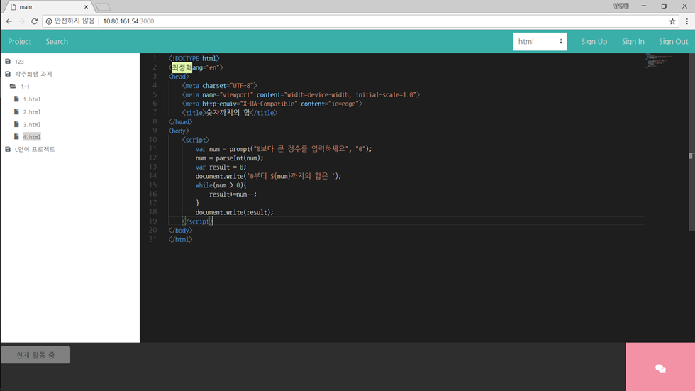
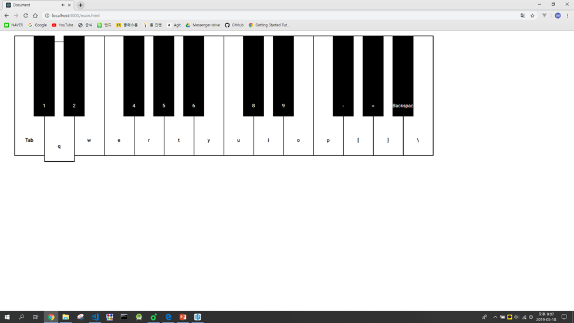
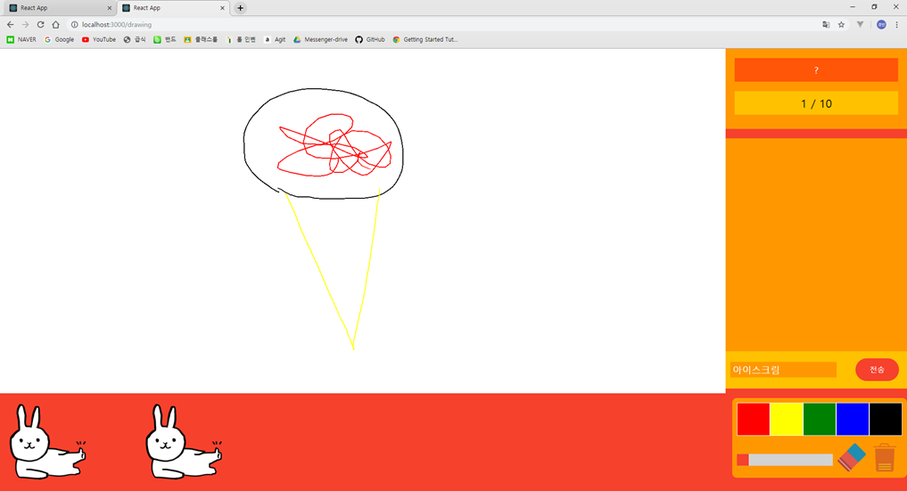
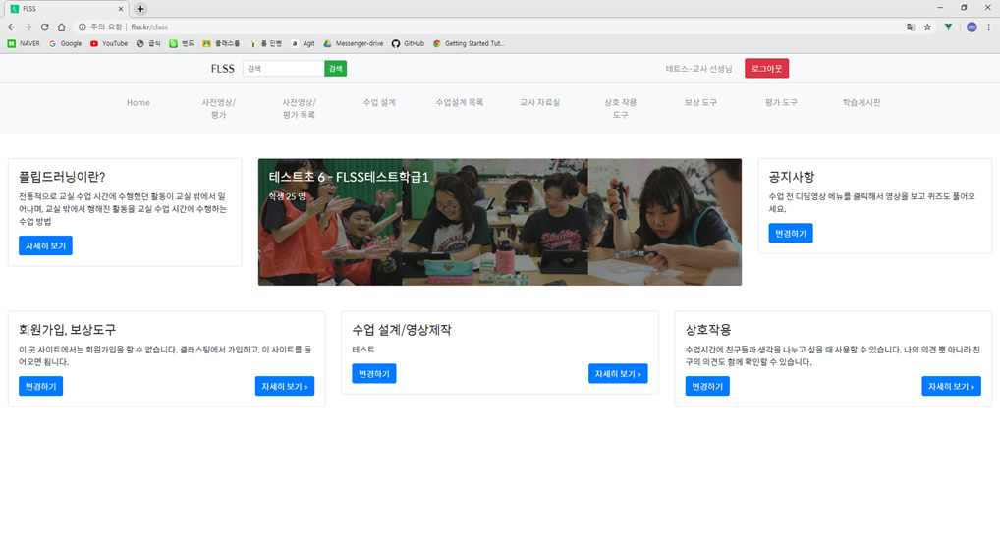
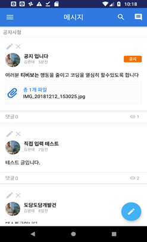
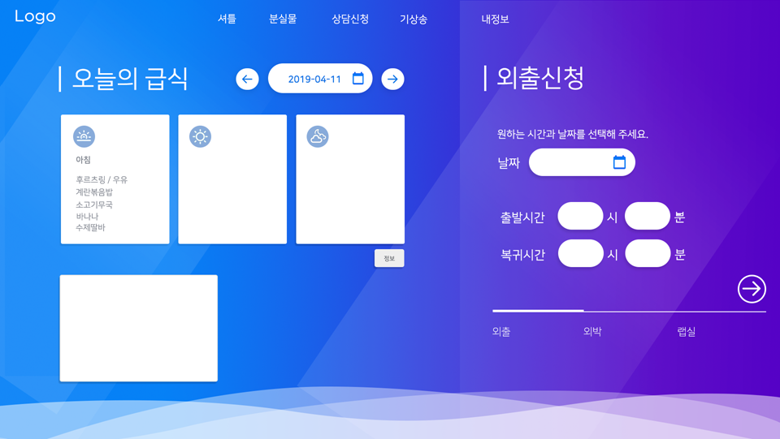
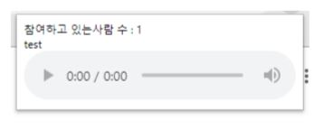

# Introduce-MySelf

## 목차

- [자기소개](#자기소개)
- [기술](#기술)
- [프로젝트](#프로젝트)

## 자기소개

<b>민경빈</b>

- phone: 010-6630-8531
- email: minkb01@gmail.com
- github: [mango906](https://github.com/mango906)
- RoekctPunch: [민경빈](https://www.rocketpunch.com/@e3c160bc65cc47bf/info)
- gitlab: [behappylife](https://gitlab.com/behappylife)

제가 아는 것들을 남들에게 가르쳐주는 삶을 살고 싶습니다.

매사를 긍정적으로 생각하는 삶을 살기 위해 노력 중입니다.

## 기술

- **프론트엔드 기술** Front-end Skills
  - HTML
  - CSS
  - JavaScript
    - JQuery
    - Vue.js
    - React
    - React Native

* **백엔드 기술** Back-end Skills

  - Node.js
    - Express.js
      - Socket.IO

* **협업**
  - Git
  - Github
  - Zeplin
  - Slack
  - Notion

* **공부중인 기술**
  
  - Redux
  - TypeScript

## 프로젝트

1. [실시간 코딩 협업 도구](#1-실시간-코딩-협업-도구)
2. [웹 기반 피아노](#2-웹-기반-피아노)
3. [웹 기반 캐치마인드 게임](#3-웹-기반-캐치마인드-게임)
4. [FLSS - 거꾸로 수업 프로젝트](#4-flss-거꾸로-수업-프로젝트)
5. [T-Messenger](#5-t-messenger)
6. [도담도담 - 편리한 기숙사 관리](#6-도담도담-편리한-기숙사-관리)
7. [Chrome - VChat](#7-크롬-확장프로그램-음성채팅)

### 1. 실시간 코딩 협업 도구

**2018-03 ~ 2018-07**

Github같은 소스 공동 작업 프로그램에서 Push, Pull, Commit등의 기능은 초심자에게 익숙하지 않다고 생각되어 진행한 프로젝트입니다.

어려운 기능, 소스코드 충돌 등의 문제를 어떻게 해결할까 하다가 구글 문서에 아이디어를 받아 만들게 되었습니다.

처음으로 한 웹 프로젝트였고, 프론트엔드를 맡으며 회원, 채팅, 전체적인 UI를 담당했습니다.

사용 기술: JQuery, Node.js, Socket.IO, MySQL

[Repository](https://github.com/tbvjaos510/RealTimeIDE)

### 2. 웹 기반 피아노

**2018-12**

한창 피아노 치던 것을 연습할 때, 밤에 피아노를 치면 생기는 소음 문제를 해결해보기 위해 진행한 개인 프로젝트입니다. 추가 확장성으로 방을 생성해 같은 방에 있는 모든 사람들에게 피아노 연주가 들려집니다. 두개의 음계를 지원합니다.

~~포트번호가 3000이라 React아이콘이 뜨게됩니다~~

사용 기술: Javascript, Node.js, Socket.IO

[Repository](https://github.com/mango906/Web-Piano-Project)

### 3. 웹 기반 캐치마인드 게임

**2019-01 ~ 2019-02**

소켓에 매력에 빠져 있던 중 제데로 소켓을 써보자 해서 진행하게 된 개인 프로젝트입니다.
처음으로 React를 사용해 구조상, 코드상 많은 부족함이 느껴지는 프로젝트입니다.
처음으로 서버 코드도 직접 짜본 프로젝트입니다.

사용 기술: React, Node.js, Socket.IO, Redux

- Repository
  - [SERVER](https://github.com/mango906/Catch_Mind_SERVER)
  - [Client](https://github.com/mango906/React_Catch_Mind)

### 4. FLSS-거꾸로 수업 프로젝트

**2018-09 ~ 2018-11**

학생들의 자기 주도적인 학습에 도움을 주고, 학교 외의 공간에서 선생님과 학생의 소통을 목적으로 한 프로젝트입니다.
학업에 관련된 기능을 분리된 플랫폼이 아닌 하나의 플랫폼으로 모아 좀 더 편안한 사용을 추구합니다.
클래스팅 API를 사용해 계정 연동을 하였습니다.

사용 기술: Vue.js, VueX, Node.js, Socket.IO

[Repository](https://github.com/DGSW-FLUT/flss-web)

[Site](http://flss.kr)

### 5. T-Messenger

**2018-08 ~ 2018-12**

기존 교사용 쿨메신저의 불편한 UI/UX를 해결하기 위해 만든 학교용 메신저 앱입니다.
글쓰기, 채팅, 설문 및 토론 기능을 지원하며 이미지 및 파일 업로드도 지원합니다.
윈도우, 모바일 플랫폼에서 지원을 하며 저는 그중 모바일 팀을 맡았습니다.
처음으로 10명이 넘는 인원에서 진행된 규모가 큰 프로젝트였고, 협업의 중요성에 대해 알게 되었습니다

사용 기술: Android, Java, Socket.IO, Retrofit, Glide, SQLite

Repository - **Private**

### 6. 도담도담-편리한 기숙사 관리

**2019-03 ~ing**

현재 학교에서 학생 위치 조회, 외출 및 외박 등 기숙사 생활과 관련된 작업들은 아날로그 식으로 진행되어 굉장히 번거롭습니다. 이런 문제를 해결하기 위해 기숙사 관리 시스템을 만들어보았습니다. 웹, 모바일, 윈도우 플랫폼에서 지원을 하며 그중 저는 웹 프론트엔드 팀을 맡았습니다.

사용기술: React, MobX, Scss, Zeplin

Repository - **Private**

### 7. 크롬-확장프로그램-음성채팅

**2019-05 ~ 2019.06**

프로젝트 실무 시간에 자유주제로 개발하는 프로젝트가 있었는데, 크롬 확장프로그램을 개발해 보고싶어 만들어본 프로젝트 입니다.

처음으로 서버로 DB와 연동을 직접 해보았고, 이 프로젝트를 진행하면서 서버에 대해서도 관심이 가기 시작했습니다.

로그인, 회원가입, 방 생성.참가, 음성 채팅 기능을 지원합니다.

사용기술: JavaScript, Node.js, Express.js, Socket.IO, Mysql

[Repository](https://github.com/mango906/Chrome-VChat)
